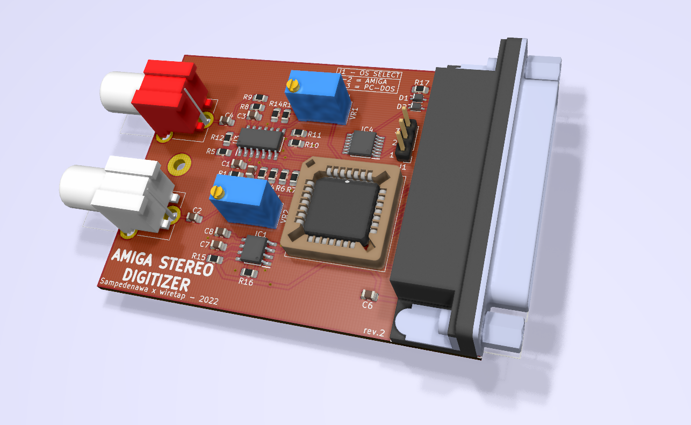

# Amiga Stereo Digitizer
Amiga Stereo Digitizer for use in importing audio samples. Stereo sound!

## Information
This is a stereo digitizer/sampler originally designed by Sampedenawa, featured in the Computer Gazette 4-95 issue. I have attached the magazine article as a PDF to this repository. Jumper J1 allows for switching between PC-DOS and Amiga. This device works in a wide variety of sampler programs, supporting stereo sound input. VR1 and VR2 potentiometers allow for gain adjustment for the right and left channels. I have included a screw hole between the RCA jacks to secure a 3D printed enclosure.

## Revision Info
Rev.1: Updated C1, C2, C3, C4 for better frequency response per Sapedenawa's recommendations. Does not impact PCB design. BOM change only.
\
Rev.0: Initial rev, per the magazine schematic.

## Other
* For Amiga 1000 support, please use the appropriate parallel port adapter to correct the pinout.
* The gain adjustment potentiometers are multi-turn. Once you set your VU levels with no clipping on the audio feed device, adjust the gain potentiometers to an acceptable level, referencing the Amiga tracker/sampler software. Once set, they should not need to be adjusted again, unless switching to another audio feed device.  
* Open hardware project, with permission from Sampedenawa.
 
